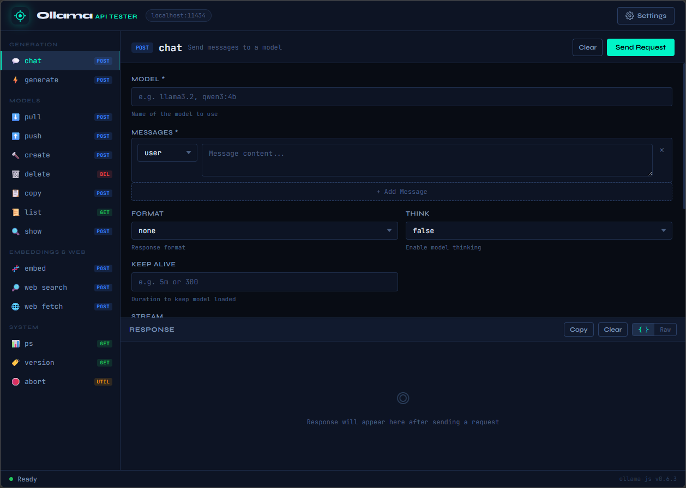

# Ollama API Tester

A progressive web app (PWA) for testing the [Ollama JavaScript API](https://github.com/ollama/ollama-js) — all endpoints, all parameters, right in your browser. No build tools or npm required.



## Features

- **All 15 endpoints** covered: `chat`, `generate`, `pull`, `push`, `create`, `delete`, `copy`, `list`, `show`, `embed`, `webSearch`, `webFetch`, `ps`, `version`, and `abort`
- **Streaming support** for `chat`, `generate`, `pull`, `push`, and `create` with live token rendering
- **Full parameter forms** for every endpoint — model options, think mode, logprobs, tools, keep_alive, and runtime options (temperature, top_p, top_k, seed, etc.)
- **Dynamic message builder** for `chat` — add, edit, and remove messages with role selection
- **JSON syntax highlighting** with formatted/raw view toggle
- **Settings dialog** to change the host URL and set an Authorization header for Ollama cloud access
- **Statusbar** showing request state, timing, and response size
- **Installable PWA** with offline support via service worker
- `Ctrl+Enter` keyboard shortcut to send requests

## Getting Started

### Prerequisites

- [Ollama](https://ollama.com) running locally (default: `http://localhost:11434`)
- Any static file server (the app uses ES modules, so it must be served over HTTP — opening `index.html` directly won't work)

### Running locally

Using Python:
```bash
python -m http.server 8080
```

Using Node.js:
```bash
npx serve .
```

Using the VS Code Live Server extension, or any other local server of your choice.

Then open `http://localhost:8080` in your browser.

### Installing as a PWA

Once the app is open in Chrome or Edge, click the install icon in the address bar to install it as a standalone desktop app.

## File Structure

```
ollama-api-tester/
├── index.html      # App shell — layout, dialogs, and HTML structure
├── app.css         # All styles — dark theme, layout, components
├── app.js          # All logic — forms, API calls, streaming, UI state
├── manifest.json   # PWA manifest
├── sw.js           # Service worker for offline support
└── README.md
```

## Configuration

Click the **Settings** button in the top-right corner to configure:

| Setting | Default | Description |
|---|---|---|
| Host Address | `http://localhost:11434` | Your Ollama server URL |
| Authorization Header | _(empty)_ | Bearer token for Ollama cloud access (e.g. `Bearer sk-...`) |

Settings are persisted in `localStorage` between sessions.

## Endpoints Reference

### Generation
| Endpoint | Method | Description |
|---|---|---|
| `chat` | POST | Send a conversation to a model with optional streaming, tools, and thinking |
| `generate` | POST | Generate text from a raw prompt |

### Models
| Endpoint | Method | Description |
|---|---|---|
| `pull` | POST | Download a model from the Ollama registry |
| `push` | POST | Upload a model to the registry |
| `create` | POST | Create a custom model from a base model |
| `delete` | DELETE | Remove a model from local storage |
| `copy` | POST | Duplicate a model under a new name |
| `list` | GET | List all locally available models |
| `show` | POST | Display detailed information about a model |

### Embeddings & Web
| Endpoint | Method | Description |
|---|---|---|
| `embed` | POST | Generate vector embeddings from text input |
| `webSearch` | POST | Search the web via Ollama cloud *(requires API key)* |
| `webFetch` | POST | Fetch a URL via Ollama cloud *(requires API key)* |

### System
| Endpoint | Method | Description |
|---|---|---|
| `ps` | GET | List models currently loaded in memory |
| `version` | GET | Get the Ollama server version |
| `abort` | — | Abort all active streamed requests on the client |

## Using Cloud Models

To use `webSearch`, `webFetch`, or cloud-hosted models via `ollama.com`:

1. Create an API key at [ollama.com/settings/keys](https://ollama.com/settings/keys)
2. Open **Settings** in the app
3. Set **Host** to `https://ollama.com`
4. Set **Authorization Header** to `Bearer <your-api-key>`

## Dependencies

The app has no build step and no local dependencies. The Ollama JS library is loaded at runtime from [esm.sh](https://esm.sh):

```js
import { Ollama } from 'https://esm.sh/ollama/browser';
```

Fonts are loaded from Google Fonts (JetBrains Mono and Syne). Both are cached by the service worker after the first load.

## Keyboard Shortcuts

| Shortcut | Action |
|---|---|
| `Ctrl+Enter` / `Cmd+Enter` | Send request |
| `Escape` | Close settings dialog |

## Browser Support

Any modern browser supporting ES modules and the Fetch API — Chrome, Firefox, Edge, Safari 15+.

## License

Apache License 2.0
